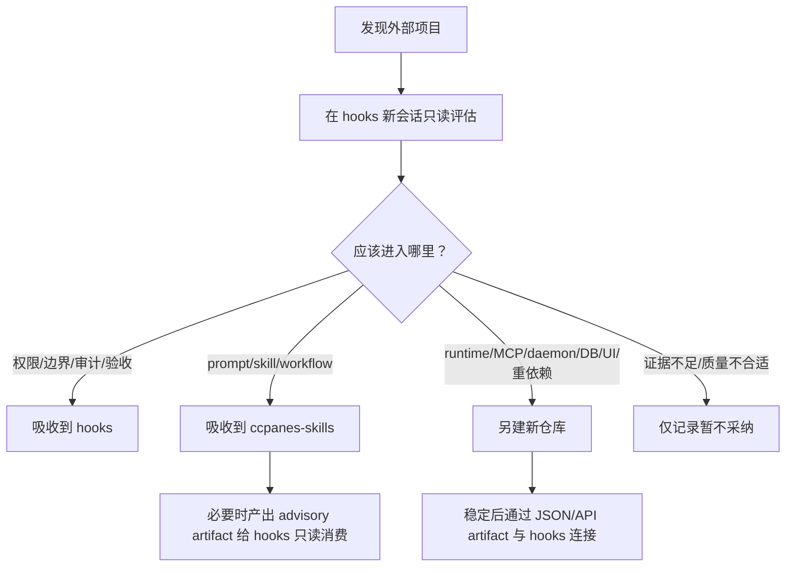

# 外部项目评估与双线仓库分流规则

日期：2026-08-14
当前权威仓库：`D:\cc-pane\tool\repos\hooks`
Companion 仓库：`D:\cc-pane\tool\repos\ccpanes-skills`

## 一句话判断

新的外部项目统一先在 `hooks` 新会话做只读评估；评估后再决定进入 `hooks`、进入 `ccpanes-skills`、另建新仓库，或仅记录暂不采纳。

## 两条线的职责

```text
hooks
  = task scope / project policy / hook hard gate / audit / acceptance / live gates

ccpanes-skills
  = agent workflow / prompt pack / external adoption lab / sidecar specs
```

`hooks` 继续保持硬权威：

- `.ccpanes-task/current-task.json` 是 task scope authority。
- `.ccpanes-task/policy.json` 是 executable project-policy authority。
- `hook-enforce` / `permission-enforce` 是 allow/block hard-gate authority。
- `post-enforce`、acceptance artifact 和 live verification 是证据链。

`ccpanes-skills` 只做软流程和孵化：

- prompt、skill、agent brief、handoff、review/debug/TDD/domain modeling。
- 外部项目 adoption 记录。
- sidecar 候选 spec。
- 给新仓库或新会话复制使用的控制提示词。

## 固定分流流程



## 进入 hooks 的条件

外部项目的思想或代码只有在影响以下 owner 时才考虑进入 `hooks`：

- task binding / Git topology / worktree scope。
- project policy capture / policy matching。
- hook event adapter / shell analyzer。
- `hook-enforce` / `permission-enforce` / `post-enforce`。
- workflow profile / StopCheck / acceptance evidence。
- production toolkit / release gate / live verification。

进入 `hooks` 必须满足：

1. 有明确本地 owner。
2. 不引入第二套权限权威。
3. 可用 TypeScript 类型、fixture、Vitest、smoke 或 acceptance 证伪。
4. 不运行上游 installer，不写用户配置。
5. 先写 adoption 记录，再写计划和测试。

## 进入 ccpanes-skills 的条件

适合进入 companion 仓库的内容：

- skill/prompt/workflow 方法。
- domain glossary、ADR、TDD seam、debug loop、review rubric、handoff 模板。
- 外部项目评估报告模板。
- 给 future workers 使用的可复制提示词。
- sidecar 候选设计，但不含成熟 runtime。

典型例子：

- `mattpocock/skills`：进入 `ccpanes-skills`，作为 agent workflow 方法源。
- `code-review-graph`：先进入 `ccpanes-skills` 的 adoption + sidecar spec；未来若要运行，再另建独立 sidecar 仓库。

## 另建新仓库的条件

当外部项目能力需要以下任一项时，先在 `ccpanes-skills/sidecar-specs` 写 spec，再由用户批准新建仓库：

- 独立 CLI / MCP server / daemon。
- 数据库、索引、缓存或项目级生成物。
- Python/Rust/Go/Node runtime 与 `hooks` TypeScript CLI 生命周期不同。
- UI、VS Code extension、GitHub Action 或其它发布面。
- 重依赖或安全/隐私边界需要单独验收。

新仓库和 `hooks` 的连接只允许通过明确 artifact/API，例如：

```json
{
  "schema": "ccpanes.<capability>.report.v1",
  "status": "pass|blocked|not-run",
  "worktreeRoot": "D:/path/to/worktree",
  "evidence": []
}
```

## 每个新项目评估会话的提示词入口

在 `hooks` 新会话中使用：

```text
请只读评估 <TARGET_URL> 对 D:\cc-pane\tool\repos\hooks 的作用，并按 docs/EXTERNAL-PROJECT-INTAKE-ROUTER.md 判断：吸收到 hooks、吸收到 D:\cc-pane\tool\repos\ccpanes-skills、另建新仓库，或仅记录暂不采纳。不要修改仓库、不要安装依赖、不要运行上游 installer、不要写用户配置。输出证据、adopted ideas、rejected ideas、推荐落点和下一步最小 artifact。
```

更完整提示词维护在：

```text
D:\cc-pane\tool\repos\ccpanes-skills\prompts\EXTERNAL-PROJECT-EVALUATION.md
D:\cc-pane\tool\repos\ccpanes-skills\prompts\NEW-REPO-CONTROLLER.md
```

## 停止条件

- 外部项目要求真实 token、PII、生产数据、远端写入或用户配置写入。
- 目标会修改 `hooks` hard gate，但没有计划、测试和验收授权。
- 当前 `hooks` 工作树存在同路径既存改动，无法通过新增独立文档避开。
- 许可证、维护状态或上游来源无法核验。

## 验证要求

只读评估至少报告：

- 当前 `hooks` root、branch、HEAD、status。
- 外部项目 URL、reference HEAD、license、主要技术栈。
- 配置写入行为和运行时副作用。
- 进入哪条线的理由。
- 下一步最小 artifact 和必要检查。
